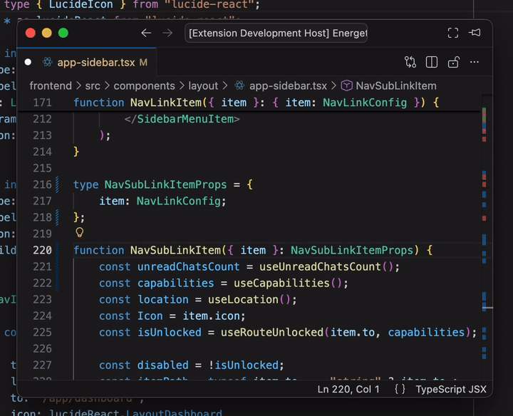

# React Props Pattern Transformer

A VSCode extension that transforms React component props between three different TypeScript patterns using AST-based transformations.



## Features

Transform between three prop definition patterns:

1. **Interface Pattern**

```typescript
interface DrawerProps {
  header: string;
}
function Drawer({ header }: DrawerProps) {
  return <></>;
}
```

2. **Type Alias Pattern**

```typescript
type DrawerProps = {
  header: string;
};
function Drawer({ header }: DrawerProps) {
  return <></>;
}
```

3. **Inline Pattern**

```typescript
function Drawer({ header }: { header: string }) {
  return <></>;
}
```

## Usage

1. Place your cursor on a React component function name
2. Press `Cmd+.` (or `Ctrl+.` on Windows/Linux) to open the Quick Fix menu
3. Select one of the transformation options:
   - "Convert to interface"
   - "Convert to type alias"
   - "Convert to inline props"

The extension uses the TypeScript Compiler API to safely transform your code while preserving:

- Type parameters (generics)
- Export modifiers
- Comments and formatting
- Heritage clauses (extends/implements)

## Installation for Development

1. Clone this repository
2. Run `npm install`
3. Run `npm run compile`
4. Press F5 to launch the Extension Development Host
5. Open a `.tsx` or `.ts` file with React components
6. Test the transformations

## Limitations

- Cannot inline types that are used in multiple places (shared types)
- Cannot inline exported types (to preserve exports)
- Only works with React components (functions that return JSX)
- Interface extends clauses are converted to intersection types when converting to type alias

## License

MIT
